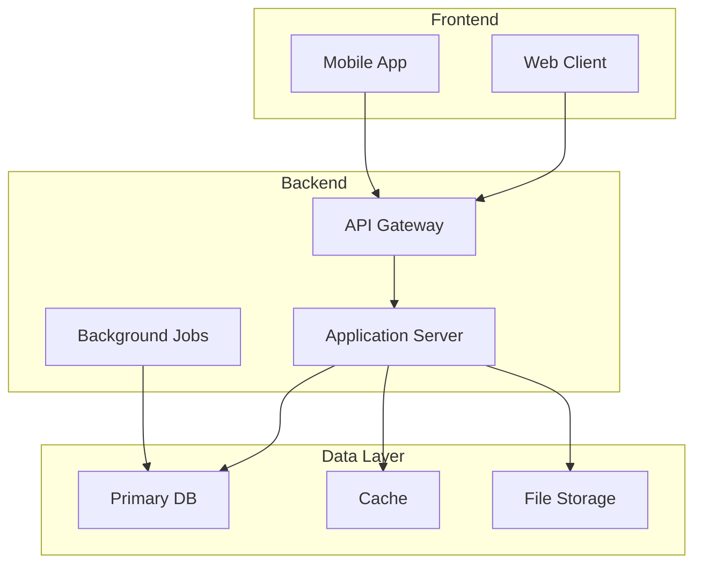
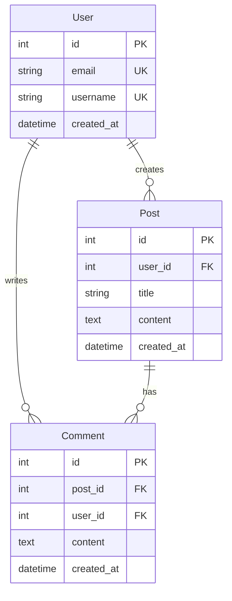

# [プロジェクト名] - プロジェクト構造と開発計画

## 📋 プロジェクト概要

### 基本情報
- **プロジェクト名**: [正式名称]
- **コードネーム**: [開発コード名]
- **バージョン**: [X.X.X]
- **作成日**: YYYY-MM-DD
- **更新日**: YYYY-MM-DD
- **ステータス**: 🟢 計画 / 🟡 開発中 / 🔵 テスト / ⚫ 完了

### 目的とビジョン
**目的**: 
[プロジェクトが解決する課題と提供する価値]

**ビジョン**: 
[プロジェクトの長期的な目標]

**対象ユーザー**: 
[想定利用者と規模]

### 主要機能一覧
| 機能名 | 概要 | 優先度 | ステータス |
|--------|------|---------|-----------|
| [機能1] | [説明] | 🔴高 | ⏳計画中 |
| [機能2] | [説明] | 🟡中 | 🚧開発中 |
| [機能3] | [説明] | 🟢低 | ✅完了 |

## 🏗️ システムアーキテクチャ

### 技術スタック
#### フロントエンド
- **フレームワーク**: [React/Vue/Angular/その他]
- **言語**: [TypeScript/JavaScript]
- **状態管理**: [Redux/Zustand/Pinia]
- **UIライブラリ**: [Material-UI/Ant Design/その他]
- **ビルドツール**: [Vite/Webpack]

#### バックエンド
- **フレームワーク**: [FastAPI/Express/Django]
- **言語**: [Python/Node.js/Go]
- **データベース**: [PostgreSQL/MySQL/MongoDB]
- **キャッシュ**: [Redis/Memcached]
- **キューシステム**: [RabbitMQ/Celery/Bull]

#### インフラストラクチャ
- **ホスティング**: [AWS/GCP/Azure/オンプレミス]
- **コンテナ**: [Docker/Kubernetes]
- **CI/CD**: [GitHub Actions/Jenkins/GitLab CI]
- **監視**: [Prometheus/Grafana/DataDog]

### システム構成図


### アーキテクチャパターン
- **設計パターン**: [MVC/MVP/MVVM/Clean Architecture]
- **API設計**: [REST/GraphQL/gRPC]
- **認証方式**: [JWT/OAuth2/SAML]
- **通信プロトコル**: [HTTP/WebSocket/MQTT]

## 📁 ディレクトリ構造

### プロジェクトルート
```
[project-name]/
├── 📁 src/                      # ソースコード
│   ├── 📁 frontend/             # フロントエンドアプリケーション
│   │   ├── 📁 components/       # UIコンポーネント
│   │   │   ├── 📁 common/       # 共通コンポーネント
│   │   │   ├── 📁 features/     # 機能別コンポーネント
│   │   │   └── 📁 layouts/      # レイアウトコンポーネント
│   │   ├── 📁 pages/           # ページコンポーネント
│   │   ├── 📁 hooks/           # カスタムフック
│   │   ├── 📁 stores/          # 状態管理
│   │   ├── 📁 services/        # APIクライアント
│   │   ├── 📁 utils/           # ユーティリティ関数
│   │   ├── 📁 types/           # TypeScript型定義
│   │   ├── 📁 styles/          # グローバルスタイル
│   │   └── 📄 App.tsx          # アプリケーションルート
│   │
│   ├── 📁 backend/             # バックエンドアプリケーション
│   │   ├── 📁 api/             # APIエンドポイント
│   │   │   ├── 📁 v1/          # APIバージョン1
│   │   │   └── 📁 v2/          # APIバージョン2
│   │   ├── 📁 core/            # コアビジネスロジック
│   │   │   ├── 📁 domain/      # ドメインモデル
│   │   │   ├── 📁 usecases/    # ユースケース
│   │   │   └── 📁 interfaces/  # インターフェース定義
│   │   ├── 📁 infrastructure/  # インフラストラクチャ層
│   │   │   ├── 📁 database/    # データベース接続
│   │   │   ├── 📁 cache/       # キャッシュ実装
│   │   │   └── 📁 external/    # 外部サービス連携
│   │   ├── 📁 models/          # データモデル
│   │   ├── 📁 services/        # サービス層
│   │   ├── 📁 repositories/    # リポジトリ層
│   │   ├── 📁 middleware/      # ミドルウェア
│   │   ├── 📁 utils/           # ユーティリティ
│   │   └── 📄 main.py          # エントリーポイント
│   │
│   └── 📁 shared/              # 共有コード
│       ├── 📁 constants/       # 定数定義
│       ├── 📁 types/           # 共通型定義
│       └── 📁 utils/           # 共通ユーティリティ
│
├── 📁 tests/                   # テストコード
│   ├── 📁 unit/                # 単体テスト
│   ├── 📁 integration/         # 結合テスト
│   ├── 📁 e2e/                 # E2Eテスト
│   └── 📁 performance/         # パフォーマンステスト
│
├── 📁 docs/                    # ドキュメント
│   ├── 📁 api/                 # API仕様書
│   ├── 📁 architecture/        # アーキテクチャ設計書
│   ├── 📁 guides/              # 開発ガイド
│   └── 📁 references/          # リファレンス
│
├── 📁 scripts/                 # スクリプト
│   ├── 📁 build/               # ビルドスクリプト
│   ├── 📁 deploy/              # デプロイスクリプト
│   └── 📁 tools/               # 開発ツール
│
├── 📁 config/                  # 設定ファイル
│   ├── 📁 environments/        # 環境別設定
│   └── 📁 docker/              # Docker設定
│
├── 📁 assets/                  # 静的リソース
│   ├── 📁 images/              # 画像ファイル
│   ├── 📁 fonts/               # フォント
│   └── 📁 icons/               # アイコン
│
├── 📁 build/                   # ビルド成果物
├── 📁 dist/                    # 配布用ファイル
├── 📄 .gitignore
├── 📄 README.md
├── 📄 package.json             # Node.js依存関係
├── 📄 requirements.txt         # Python依存関係
└── 📄 docker-compose.yml       # Docker構成
```

### 主要ファイルの説明
| ファイル/ディレクトリ | 役割 | 備考 |
|---------------------|------|------|
| `src/frontend/` | フロントエンドコード | [詳細] |
| `src/backend/` | バックエンドコード | [詳細] |
| `tests/` | テストコード | [詳細] |
| `docs/` | プロジェクトドキュメント | [詳細] |

## 🗄️ データベース設計

### ER図


### テーブル定義
#### users テーブル
| カラム名 | 型 | 制約 | 説明 |
|---------|-----|------|------|
| id | BIGINT | PK, AUTO_INCREMENT | ユーザーID |
| email | VARCHAR(255) | UNIQUE, NOT NULL | メールアドレス |
| username | VARCHAR(100) | UNIQUE, NOT NULL | ユーザー名 |
| created_at | TIMESTAMP | NOT NULL | 作成日時 |

[他のテーブルも同様に記載]

### インデックス設計
```sql
-- パフォーマンス最適化のためのインデックス
CREATE INDEX idx_posts_user_id ON posts(user_id);
CREATE INDEX idx_posts_created_at ON posts(created_at DESC);
CREATE INDEX idx_comments_post_id ON comments(post_id);
```

## 🔌 API仕様

### エンドポイント一覧
| メソッド | パス | 概要 | 認証 |
|---------|------|------|------|
| POST | `/api/v1/auth/login` | ログイン | 不要 |
| GET | `/api/v1/users` | ユーザー一覧 | 必要 |
| POST | `/api/v1/posts` | 投稿作成 | 必要 |
| GET | `/api/v1/posts/{id}` | 投稿詳細 | 不要 |

### レスポンス形式
```json
{
  "success": true,
  "data": {},
  "error": null,
  "metadata": {
    "timestamp": "2025-01-20T12:00:00Z",
    "version": "v1"
  }
}
```

### エラーコード
| コード | 説明 | HTTPステータス |
|--------|------|--------------|
| E001 | 認証エラー | 401 |
| E002 | 権限不足 | 403 |
| E003 | リソース未発見 | 404 |
| E004 | バリデーションエラー | 422 |

## 🚀 開発・デプロイ

### 開発環境の初期構築手順
```bash
# 1. プロジェクトルートに移動
cd main-project/

# 2. ソースコードディレクトリ作成（Documents/と同階層）
mkdir -p src/{frontend,backend,shared}
mkdir -p tests/{unit,integration,e2e}
mkdir -p config/environments
mkdir -p scripts/{build,deploy,tools}
mkdir -p assets/{images,fonts,icons}

# 3. 設定ファイル作成
touch package.json
touch requirements.txt
touch README.md

# 4. 確認（正しい構造）
ls -la
# 出力例:
# .claude/
# Documents/
# src/          ← Documents/と同じ階層
# tests/        ← Documents/と同じ階層
# config/       ← Documents/と同じ階層
# ...
```

### ⚠️ よくある間違いと対策
```bash
# ❌ 間違い: Documents/内に作成
cd Documents/
mkdir src  # これは間違い！

# ✅ 正解: main-project/直下に作成
cd main-project/
mkdir src  # Documents/と同じ階層
```

### 環境構成
| 環境 | URL | 用途 | 更新頻度 |
|------|-----|------|---------|
| Development | http://localhost:3000 | 開発 | 随時 |
| Staging | https://staging.example.com | 検証 | 日次 |
| Production | https://example.com | 本番 | 週次 |

### 必要な環境変数
```env
# アプリケーション設定
APP_NAME=MyApp
APP_ENV=development
APP_PORT=3000

# データベース設定
DB_HOST=localhost
DB_PORT=5432
DB_NAME=myapp
DB_USER=dbuser
DB_PASSWORD=

# 外部サービス
API_KEY=
SECRET_KEY=
```

### ビルド・デプロイ手順
```bash
# 開発環境セットアップ
npm install
pip install -r requirements.txt

# 開発サーバー起動
npm run dev
python main.py

# プロダクションビルド
npm run build
docker build -t myapp:latest .

# デプロイ
docker-compose up -d
```

## 📊 非機能要件

### パフォーマンス要件
| 項目 | 目標値 | 現在値 | 状態 |
|------|--------|--------|------|
| レスポンス時間 | <200ms | 150ms | ✅ |
| 同時接続数 | 10,000 | 8,000 | ⚠️ |
| スループット | 1,000 req/s | 1,200 req/s | ✅ |
| 可用性 | 99.9% | 99.95% | ✅ |

### セキュリティ要件
- [ ] HTTPS通信の強制
- [ ] SQLインジェクション対策
- [ ] XSS対策
- [ ] CSRF対策
- [ ] 認証・認可の実装
- [ ] データ暗号化
- [ ] 監査ログ

### スケーラビリティ
- **水平スケーリング**: 対応済み（Kubernetes）
- **垂直スケーリング**: 制限あり（最大64GB RAM）
- **データベース**: リードレプリカ対応
- **キャッシュ戦略**: Redis Cluster

## 📅 開発スケジュール

### マイルストーン
| フェーズ | 期間 | 完了予定 | 状態 |
|---------|------|---------|------|
| Phase 1: 基盤構築 | 4週間 | YYYY-MM-DD | ✅完了 |
| Phase 2: コア機能 | 6週間 | YYYY-MM-DD | 🚧進行中 |
| Phase 3: 拡張機能 | 4週間 | YYYY-MM-DD | ⏳計画中 |
| Phase 4: テスト | 2週間 | YYYY-MM-DD | ⏳計画中 |
| Phase 5: リリース | 1週間 | YYYY-MM-DD | ⏳計画中 |

### 詳細タスク
```gantt
ganttDiagram
    title 開発スケジュール
    dateFormat  YYYY-MM-DD
    
    section 基盤構築
    環境構築           :done,    des1, 2025-01-01, 7d
    アーキテクチャ設計  :done,    des2, after des1, 7d
    
    section コア機能
    認証機能           :active,  dev1, 2025-01-15, 14d
    CRUD実装           :         dev2, after dev1, 14d
```

## ✅ 成功指標（KPI）

### ビジネス指標
| KPI | 目標 | 現在 | 達成率 |
|-----|------|------|--------|
| MAU（月間アクティブユーザー） | 10,000 | 7,500 | 75% |
| 顧客満足度 | 4.5/5.0 | 4.2/5.0 | 93% |
| 処理時間削減率 | 70% | 65% | 93% |
| エラー率 | <0.1% | 0.08% | ✅ |

### 技術指標
| KPI | 目標 | 現在 | 達成率 |
|-----|------|------|--------|
| コードカバレッジ | >80% | 75% | 94% |
| ビルド時間 | <5分 | 4分30秒 | ✅ |
| デプロイ頻度 | 週5回 | 週4回 | 80% |
| MTTR（平均復旧時間） | <30分 | 25分 | ✅ |

## 🎯 次のアクション

### 即座に実施（今週）
- [ ] [タスク1]
- [ ] [タスク2]
- [ ] [タスク3]

### 短期（今月）
- [ ] [タスク1]
- [ ] [タスク2]

### 中期（3ヶ月）
- [ ] [タスク1]
- [ ] [タスク2]

## 📝 変更履歴

| バージョン | 日付 | 変更内容 | 変更者 |
|-----------|------|---------|--------|
| v2.0 | YYYY-MM-DD | メジャーアップデート：アーキテクチャ変更 | [名前] |
| v1.1 | YYYY-MM-DD | マイナー修正：API追加 | [名前] |
| v1.0 | YYYY-MM-DD | 初版作成 | [名前] |

## 🔗 関連ドキュメント

### 内部ドキュメント
- [要件定義書](./Documents/requirements/requirements_definition.md)
- [技術仕様書](./Documents/requirements/technical_specification.md)
- [API仕様書](./docs/api/openapi.yaml)
- [データベース設計書](./docs/database/schema.md)

### 外部リンク
- [プロジェクト管理（Jira/GitHub Projects）](URL)
- [デザインファイル（Figma）](URL)
- [CI/CDダッシュボード](URL)
- [監視ダッシュボード](URL)

## ⚠️ リスクと課題

### 技術的リスク
| リスク | 影響度 | 発生確率 | 対策 |
|--------|--------|---------|------|
| [リスク1] | 高 | 中 | [対策] |
| [リスク2] | 中 | 低 | [対策] |

### ビジネスリスク
| リスク | 影響度 | 発生確率 | 対策 |
|--------|--------|---------|------|
| [リスク1] | 高 | 低 | [対策] |

### 未解決の課題
- 🔴 [重要度:高] [課題1]
- 🟡 [重要度:中] [課題2]
- 🟢 [重要度:低] [課題3]

---

**作成日**: YYYY-MM-DD  
**更新日**: YYYY-MM-DD  
**バージョン**: X.X.X  
**承認者**: [承認者名]  
**次回レビュー**: YYYY-MM-DD